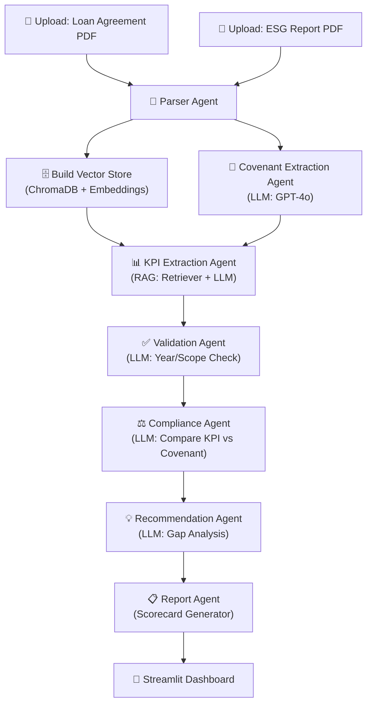

# 🌱 ESG Covenant Compliance Checker — Implementation Plan

## Problem Summary
Build a GenAI-based agentic application that automatically extracts ESG KPIs from sustainability reports, compares them against loan agreement covenants, and generates a compliance scorecard with Pass/Fail status, remediation recommendations, and a confidence score.

## Analysis of Existing Code

The existing project at `esg_agentic_checker/` has a basic skeleton but is **fundamentally broken**:

| Issue | Details |
|-------|---------|
| **Agents are stubs** | `compliance_agent` always returns "PASS", `validation_agent` always returns `True`, `recommendation_agent` returns hardcoded strings — no actual AI reasoning |
| **Covenant agent disconnected** | Imported in `app.py` but never added to the LangGraph workflow, so no covenants are ever extracted |
| **KPI agent disconnected** | Never added to graph, never called — no KPI extraction happens |
| **LLM/retriever not passed** | `build_graph()` takes no arguments, agents in the graph don't receive `llm` or `retriever` |
| **Empty state init** | `workflow.invoke()` passes empty strings/lists, bypassing the parser |
| **SSL import mismatch** | `app.py` imports `http_client` but `ssl_fix.py` exports `client` |
| **No sample documents** | No test PDFs to demo with |
| **No structured output** | Covenants returned as raw LLM text, not parsed JSON |
| **UI is minimal** | Basic Streamlit with no styling, no progress indicators |

> [!IMPORTANT]
> **Recommendation**: Build a **new, clean project** in the `ESG/` workspace directory rather than patching the broken skeleton. We'll keep the same architecture (LangGraph + agents) but with everything actually working.

---

## Proposed Architecture



### Agent Pipeline (6 Nodes in LangGraph)

| # | Agent | Input | Output | Uses LLM? |
|---|-------|-------|--------|-----------|
| 1 | **Parser Agent** | Raw PDFs | Extracted text with page numbers | No (PyMuPDF) |
| 2 | **Covenant Extraction Agent** | Loan text | Structured JSON: `[{id, kpi_name, target_value, target_unit, deadline_year, condition}]` | ✅ GPT-4o |
| 3 | **KPI Extraction Agent** | Covenants + ESG Report (via RAG) | `[{covenant_id, actual_value, actual_unit, reporting_year, source_page, source_section}]` | ✅ GPT-4o + RAG |
| 4 | **Validation Agent** | KPIs + Covenants | Validates year match, unit consistency, data completeness | ✅ GPT-4o |
| 5 | **Compliance Agent** | Validated KPIs + Covenants | `[{covenant_id, status: PASS/FAIL/PARTIAL, actual_vs_target, reasoning}]` | ✅ GPT-4o |
| 6 | **Recommendation Agent** | Failed/Partial covenants | `[{covenant_id, remediation, priority}]` + overall confidence score | ✅ GPT-4o |

---

## Proposed Changes

### Core Configuration

#### [NEW] [.env](file:///c:/Users/GenAITVMSEZUSR51/Desktop/22_May/Mini%20Project/ESG/.env)
- API_KEY, BASE_URL, LLM_MODEL (`azure/genailab-maas-gpt-4o`), EMBED_MODEL
- Note: Upgrading from `gpt-4o-mini` to `gpt-4o` as specified in constraints

#### [NEW] [requirements.txt](file:///c:/Users/GenAITVMSEZUSR51/Desktop/22_May/Mini%20Project/ESG/requirements.txt)
- langchain, langgraph, langchain-openai, langchain-community, chromadb, streamlit, pymupdf, pydantic, httpx, python-dotenv, tiktoken

---

### Utils Module

#### [NEW] utils/ssl_fix.py
- Fix the import name mismatch (`http_client` not `client`)
- Tiktoken cache setup with correct path resolution
- `httpx.Client(verify=False)` for SSL bypass

#### [NEW] utils/pdf_parser.py
- PyMuPDF-based text extraction **with page numbers preserved**
- Returns `List[{page_num, text}]` so we can trace source pages in output
- Handles edge cases (encrypted PDFs, empty pages)

#### [NEW] utils/vector_store.py
- ChromaDB vector store builder with metadata (page numbers, section headers)
- `RecursiveCharacterTextSplitter` with 1500 char chunks, 300 overlap
- Stores page number in chunk metadata for source tracing

---

### Models Module

#### [NEW] models/state.py
- Pydantic-style `TypedDict` for LangGraph state
- Fields: `loan_text`, `report_pages`, `covenants` (structured list), `kpis` (structured list), `validation_results`, `compliance_results`, `recommendations`, `confidence_score`, `final_report`

#### [NEW] models/schemas.py
- Pydantic models for structured output:
  - `Covenant`: id, kpi_name, target_value, target_unit, deadline_year, condition_text
  - `ExtractedKPI`: covenant_id, actual_value, actual_unit, reporting_year, source_page, source_section
  - `ComplianceResult`: covenant_id, status (PASS/FAIL/PARTIAL), actual_vs_target, reasoning
  - `Remediation`: covenant_id, action, priority (HIGH/MEDIUM/LOW)
  - `FinalReport`: scorecard list, overall_score, summary

---

### Agents Module (All rebuilt from scratch)

#### [NEW] agents/parser_agent.py
- Node function for LangGraph
- Calls `pdf_parser.extract_text_with_pages()` for both documents
- Updates state with structured page-level text

#### [NEW] agents/covenant_agent.py
- Receives `llm` via closure/partial
- Detailed prompt engineering: extracts all ESG covenants with structured fields
- Uses LLM's JSON mode for reliable structured output
- Parses response into `List[Covenant]`

#### [NEW] agents/kpi_agent.py
- Receives `llm` + `retriever` via closure
- For each covenant, queries the vector store with targeted questions
- Extracts actual KPI values, reporting year, and source page/section
- Returns `List[ExtractedKPI]`

#### [NEW] agents/validation_agent.py
- Uses LLM to verify:
  - Reporting year matches covenant deadline
  - Units are consistent (e.g., tCO2e vs kg CO2)
  - Data completeness (was a value actually found?)
- Flags data quality issues

#### [NEW] agents/compliance_agent.py
- Uses LLM to compare each covenant target vs actual KPI
- Determines PASS / FAIL / PARTIAL with reasoning
- Handles percentage reductions, absolute targets, threshold comparisons

#### [NEW] agents/recommendation_agent.py
- For failed/partial covenants: generates specific remediation actions
- Calculates overall ESG Compliance Confidence Score (0-100)
- Weighs by number of passed vs failed, data quality, and covenant severity

---

### Graph Module

#### [NEW] graph/workflow.py
- Builds LangGraph `StateGraph` with all 6 agents as nodes
- Linear pipeline: parser → covenant → kpi → validation → compliance → recommendation
- Agents receive `llm`, `retriever` via `functools.partial`

---

### Main Application

#### [NEW] app.py
- **Premium Streamlit UI** with:
  - Custom CSS: dark theme, glassmorphism cards, gradient accents
  - Animated progress bar showing agent pipeline execution
  - Two-column file upload with drag-and-drop
  - Results displayed as:
    - **Covenant Scorecard Table** with color-coded Pass/Fail badges
    - **Remediation cards** for failed covenants
    - **Gauge/metric** for confidence score
    - **Expandable details** with source page references
  - Download button for JSON export of full results

---

### Sample Test Documents

#### [NEW] samples/sample_loan_agreement.pdf
- Generate a realistic sample loan agreement with ESG covenants
- 3-5 covenants covering emissions, renewable energy, water usage

#### [NEW] samples/sample_esg_report.pdf  
- Generate a realistic ESG sustainability report with KPI tables
- Matching metrics for the sample covenants (some pass, some fail)

> [!NOTE]
> We'll create these as text-based PDFs using Python's `reportlab` or `fpdf` library so we have working demo data for the 5-minute demo.

---

## File Structure

```
ESG/
├── .env                          # API credentials
├── requirements.txt              # Dependencies
├── app.py                        # Streamlit main app (premium UI)
├── tiktoken_cache/               # (existing) local tiktoken cache
├── localized_tiktoken_setup.md   # (existing) tiktoken docs
├── utils/
│   ├── __init__.py
│   ├── ssl_fix.py                # httpx SSL bypass + tiktoken setup
│   ├── pdf_parser.py             # PyMuPDF text extraction with pages
│   └── vector_store.py           # ChromaDB builder with metadata
├── models/
│   ├── __init__.py
│   ├── state.py                  # LangGraph state TypedDict
│   └── schemas.py                # Pydantic data models
├── agents/
│   ├── __init__.py
│   ├── parser_agent.py           # PDF parsing node
│   ├── covenant_agent.py         # Covenant extraction (LLM)
│   ├── kpi_agent.py              # KPI extraction (RAG + LLM)
│   ├── validation_agent.py       # Data validation (LLM)
│   ├── compliance_agent.py       # Pass/Fail comparison (LLM)
│   └── recommendation_agent.py   # Remediation + scoring (LLM)
├── graph/
│   ├── __init__.py
│   └── workflow.py               # LangGraph pipeline
├── samples/
│   └── generate_samples.py       # Script to create sample PDFs
└── chroma_db/                    # ChromaDB persistence (auto-created)
```

---

## UI Design (Streamlit)

The UI will feature:

1. **Header**: Gradient banner with title and pipeline visualization
2. **Upload Section**: Two glassmorphism cards for loan/report upload
3. **Pipeline Progress**: Step-by-step progress indicator showing each agent's status
4. **Results Dashboard**:
   - 🎯 **Confidence Score Gauge** — large metric with color (green/yellow/red)
   - 📊 **Covenant Scorecard Table** — sortable with color-coded status badges
   - 💡 **Remediation Panel** — expandable cards for each failed covenant
   - 📥 **Export Button** — download full JSON report

---

## Verification Plan

### Automated Tests
1. Run `streamlit run app.py` and verify the UI loads without errors
2. Upload sample PDFs and run the full pipeline
3. Verify structured JSON output contains all required fields
4. Check that source page references are accurate

### Manual Verification
1. Verify covenant extraction correctly identifies all ESG clauses from sample loan agreement
2. Verify KPI extraction pulls correct values from ESG report
3. Confirm Pass/Fail determination is logical and well-reasoned
4. Check remediation recommendations are specific and actionable
5. Validate confidence score calculation

### Demo Rehearsal
- Time the full pipeline execution (target: under 2 minutes)
- Practice 5-minute demo flow: upload → run → show scorecard → show remediations → export
